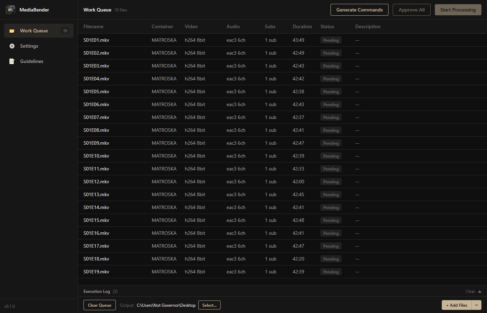
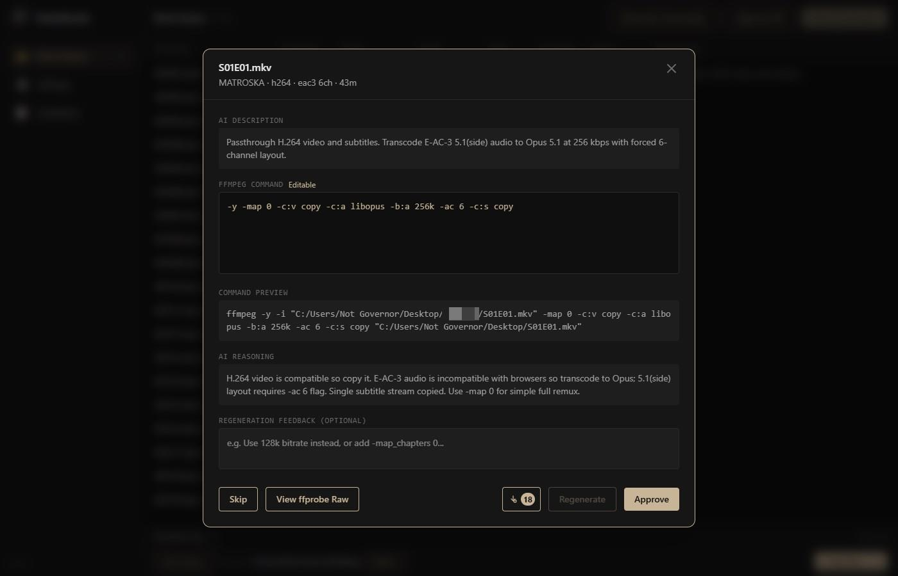
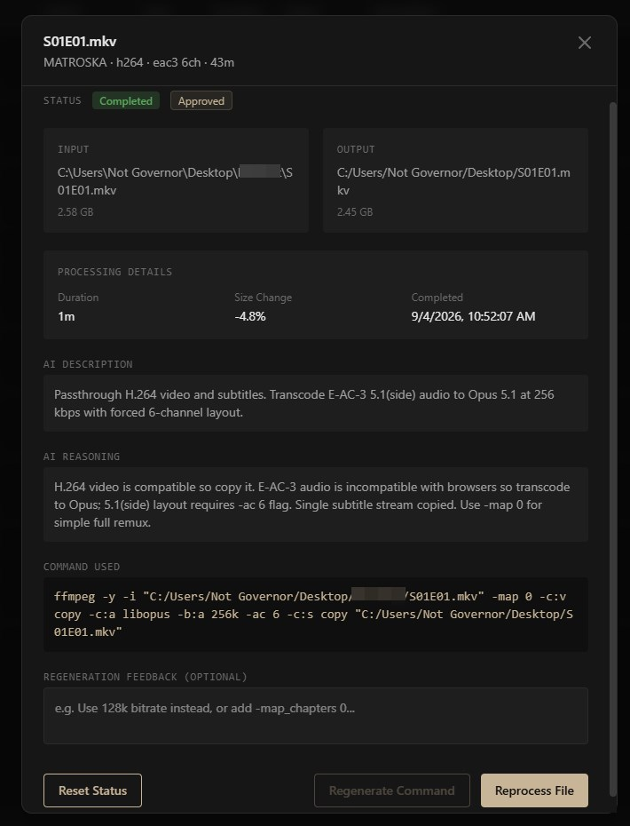

# MediaBender

<p align="center">
  
</p>

<p align="center">
  <strong>AI-assisted FFmpeg video transcoding.</strong>
</p>

Uses your favorite AI model to inspect, plan, and automate media transcoding. For a large video library you need to curate, or for frequently massaging files from infinite codecs into a planned target.

You bring FFmpeg. An OpenAI-compatible API (or a local server) writes the argv; you review and approve before anything is encoded.

Desktop app: Tauri v2 + SolidJS + Rust.

## Screenshots

Work Queue: probe a folder, then generate commands, approve, and start.

<p align="center">
  
</p>

Review: AI description and reasoning, editable FFmpeg args, approve or regenerate.

<p align="center">
  
</p>

Completed job: status, size change, command used, reset or reprocess.

<p align="center">
  
</p>

## Download

Installers (Windows NSIS, macOS DMG, Linux AppImage): [GitHub Releases](https://github.com/NotGovernor/MediaBender/releases).

macOS and Linux builds are not well tested.

Unsigned binaries: Windows SmartScreen → More info → Run anyway. macOS Gatekeeper → right-click Open.

From 0.3.0, a packaged app can check GitHub Releases and install the next version itself (sidebar footer). 0.1.x / 0.2.x still download from this page.

## FFmpeg

MediaBender does **not** ship FFmpeg. Install it yourself, then set/verify paths in Settings.

- Windows: [ffmpeg.org/download.html](https://ffmpeg.org/download.html) or `winget install FFmpeg`
- macOS: `brew install ffmpeg`
- Linux: distro package (`ffmpeg` + `ffprobe` on PATH)

## Develop

Requires Node.js 20+, Rust (rustup), and platform Tauri deps (Windows: VS Build Tools + WebView2).

```bash
npm install
npm test
cargo test --manifest-path src-tauri/Cargo.toml --lib
npm run tauri dev
```

Do not share `node_modules` between WSL and Windows (`lightningcss` is native).

## License

See [`LICENSE`](LICENSE).

## Code of conduct

[`CODE_OF_CONDUCT.md`](CODE_OF_CONDUCT.md) (Code of Adult Conduct).

## Features

- AI-generated FFmpeg argv from ffprobe metadata (OpenAI-compatible providers)
- Scan folders / add files into a Work Queue
- Review, edit args, approve, then batch process
- Live FFmpeg log; Stop cancels and deletes incomplete output
- Settings, guidelines, and queue persist locally
